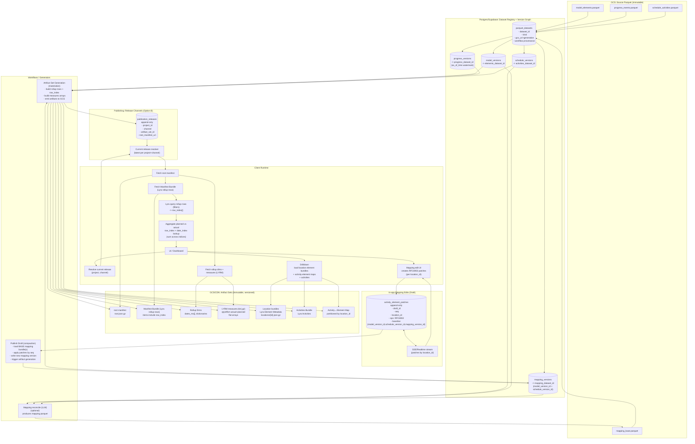

# Changelog

All notable changes to this project will be documented in this file.

The format is based on [Keep a Changelog](https://keepachangelog.com/en/1.0.0/),
and this project adheres to [Semantic Versioning](https://semver.org/spec/v2.0.0.html).

## [1.0.0] - 2025-01-XX

### Added

- **Core bundle functionality**
  - Precomputed faceted index bundles from structured data
  - Manifest-driven bundle format with field definitions and capabilities
  - Deterministic query execution over bundles
  - Support for both explicit and simple configuration modes

- **Faceted filtering**
  - Fast equality filters on facet fields
  - Support for single values and arrays of values
  - Posting list indexes for efficient intersection operations

- **Range queries**
  - Numeric range filtering (`min`/`max`)
  - Date range filtering with Unix timestamp support
  - Runtime type checking and validation

- **Schema helpers**
  - `buildQuerySchema()` - Generate JSON schema from bundle manifest
  - Type-safe query schema generation driven by manifest capabilities

- **OpenAI tool adapter**
  - `buildOpenAiTool()` - Generate OpenAI function tool definitions
  - Automatic schema derivation from bundle manifest
  - Agent-friendly tool integration patterns

- **Dashboard helpers**
  - `getFacetSummary()` - Get distinct values and counts for facet fields
  - `includeFacetCounts` query option for drilldown UIs
  - Support for filtered facet summaries

- **Bundle format specification**
  - Normative JSON format specification documented in `docs/bundle-json-spec.md`
  - Version 1.x bundle format with stable manifest structure
  - Deterministic serialization and deserialization

- **Performance baseline**
  - Optimized for sub-millisecond facet queries
  - Efficient index structures for medium-sized datasets
  - Practical performance profile for single-machine/edge runtimes

### Documentation

- Comprehensive README with usage examples
- Bundle format specification documentation
- Versioning guide explaining npm package vs bundle format versions
- Example projects demonstrating basic usage and agent integration

[1.0.0]: https://github.com/vectoral-io/lyra/releases/tag/v1.0.0

