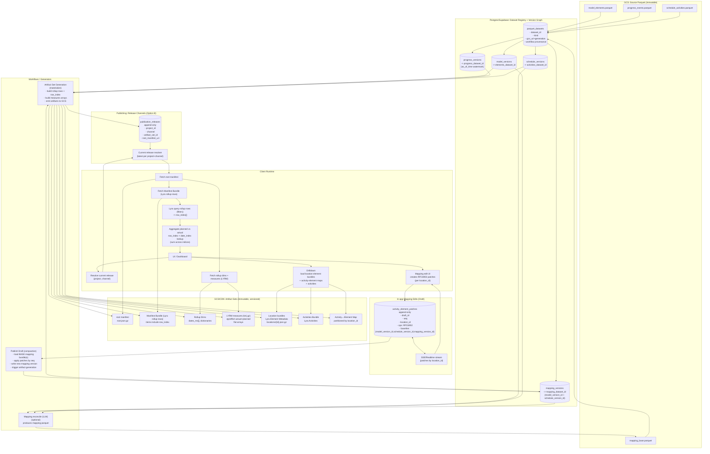

# 1.0.0 (2026-06-22)

* feat!: automate releases with semantic-release ([b7b2df0](https://github.com/vectoral-io/lyra/commit/b7b2df0e33216392bfcabb203f4a4195d4658959))

### Bug Fixes

* **ci:** declare eslint config's imports as direct devDependencies ([c070b64](https://github.com/vectoral-io/lyra/commit/c070b643bc25aacc1b13f23b38457a8fe83ece81))
* correct formatting in bundle and builders files by adjusting else statement placement for improved readability. ([8d038b8](https://github.com/vectoral-io/lyra/commit/8d038b836013de839025c909161d36a85cfa879e))
* **examples:** update to v5 API and regenerate loadable bundles ([b380fc8](https://github.com/vectoral-io/lyra/commit/b380fc87794ff8cc2bc86aca4a363c547f3a62f7))
* **security:** harden untrusted-bundle deserialization ([e3b6fe2](https://github.com/vectoral-io/lyra/commit/e3b6fe2dde00b45bdcf488d54ae5bf536de2d140))
* update type import for range filtering to use RangeBound instead of RangeFilter in array-operations.ts ([47c56cd](https://github.com/vectoral-io/lyra/commit/47c56cd542d722eae964d12da1ea89f4d2e751d9))

### Features

* add benchmark diffing script and new benchmark scenarios for performance tracking. Introduced `bench:diff` script to compare latest benchmark results against baseline, highlighting performance regressions. Updated benchmark data for improved performance metrics across various scenarios, including alias resolution and range filtering. Enhanced micro-benchmarks for intersection and union operations to facilitate detailed performance analysis. ([b6973fa](https://github.com/vectoral-io/lyra/commit/b6973fa363be6841e9bf5f12cb96db357a7258f4))
* add field inclusion and exclusion capabilities in LyraBundle. Introduce includeFields and excludeFields options in CreateBundleConfig to control item fields in bundles. Implement filterItemFields utility to manage field filtering logic, ensuring protected fields are always included and alias fields are excluded. Update tests to validate new configurations and behavior. ([957c65c](https://github.com/vectoral-io/lyra/commit/957c65cbcd6f4662b35c685df2a3947c96a2e349))
* enhance alias functionality in LyraBundle with new methods for alias resolution and enrichment. Introduce getAliasValues, getAliasMap, getAllAliases, and enrichItems methods for efficient alias handling. Update query behavior to require explicit opt-in for alias enrichment, improving performance and backward compatibility. Comprehensive tests added to validate new features and ensure expected behavior. ([7ca15a9](https://github.com/vectoral-io/lyra/commit/7ca15a9ed619ddb2a187f4f39758c903f3366eae))
* introduce Lyra v2 with explicit query operators, including `equal`, `notEqual`, `isNull`, and `isNotNull`. Remove deprecated `facets` field and enhance query capabilities with dimension-aware aliases. Update documentation and migration guide to reflect breaking changes and new features. Comprehensive tests added for new operators and alias functionality. ([0e43b85](https://github.com/vectoral-io/lyra/commit/0e43b8570c07349e8de45fd5d850c46682503328))
* introduce support for array queries in Lyra, allowing complex multi-condition filtering with union and intersection modes. Update query schema to accommodate array formats for facets and ranges, and enhance documentation to reflect new capabilities and usage examples. Add comprehensive tests for array query functionality. ([ed5dbca](https://github.com/vectoral-io/lyra/commit/ed5dbca560e46237e75cdfe0609869799320b034))
* optimize range filtering and array merging in LyraBundle. Introduce scratchRange for efficient range operations, enhance mergeUnionSorted for small array cases, and improve filterIndicesByRange to utilize pre-computed field types. Update benchmark results reflecting performance improvements. ([af92cd0](https://github.com/vectoral-io/lyra/commit/af92cd0b22781fe8be5a8a30f103ba3f8ab3ddfb))
* release Lyra v4.1.0 with binary container format and columnar item storage. Introduced `ItemStore` abstraction for efficient data handling, improved serialization performance, and added optional fields for faster hydration. Updated documentation and migration guide for seamless transition from v3.x to v4.x formats. ([d71026d](https://github.com/vectoral-io/lyra/commit/d71026dd718a802661e8dc520466fb14315f0cf4))
* release Lyra v5.0.0 with major updates and cleanup. Removed deprecated types and improved TypeScript definitions. Enhanced documentation for API changes, including updated query handling and schema generation. Added `.gitignore` entries for stray compiled declarations to maintain a cleaner source tree. ([e1044f3](https://github.com/vectoral-io/lyra/commit/e1044f3736dbaaecfae639074689e90e7f02440c))
* update dependencies and enhance TypeScript definitions. Upgraded various devDependencies to their latest versions for improved performance and compatibility. Added new TypeScript types and methods for alias handling in LyraBundle, including projection capabilities in queries. Introduced new utility functions for filtering and managing item fields, enhancing overall query efficiency and flexibility. ([75b303e](https://github.com/vectoral-io/lyra/commit/75b303e47cd5b94e828df4eefcbdffb5b644f2e0))
* upgrade to Lyra v3.0.0 with significant API cleanup and performance improvements. Rebuild required for existing bundles due to format changes. Introduced new alias handling methods and optimized query processing with precomputed null posting lists. Updated documentation and migration guide to assist users in transitioning from v2 to v3. ([a9eb6a2](https://github.com/vectoral-io/lyra/commit/a9eb6a21448b47f39be9340fd98dcb1f8eb8b530))

### BREAKING CHANGES

* the v5 line removes QuerySchemaOptions and the second argument
to buildQuerySchema, and makes FieldDefinition a discriminated union on kind
(range must be number|date; alias requires targetField; only alias may carry
one). The on-the-wire bundle format is unchanged; valid bundles load as before.

# Changelog

All notable changes to this project will be documented in this file.

The format is based on [Keep a Changelog](https://keepachangelog.com/en/1.0.0/),
and this project adheres to [Semantic Versioning](https://semver.org/spec/v2.0.0.html).

> Releases from 5.0.0 onward are generated automatically by semantic-release
> from conventional commits. Entries below 5.0.0 are the prior hand-written history.

## [4.1.0] - 2026-05-07

### Added

- **Columnar items inside the v4 binary container** (default for new bundles).
  - String fields → dictionary-encoded UTF-8 string table + `Uint32Array` row → dict-id indices.
  - Number / date fields → raw little-endian `Float64Array` bytes (8-byte aligned, zero-copy view when alignment permits).
  - Boolean fields → packed bits (`(n + 7) / 8` bytes).
  - Arrays / objects / mixed-type fields → per-row JSON byte ranges (json-fallback).
  - Every column carries a 1-bit-per-row null bitmap so `null` survives round-trip distinct from `''` / `0` / `false`.
- **`ItemStore<T>` abstraction** (`src/utils/item-store.ts`).
  - `RowItemStore<T>` wraps `T[]` (used at `createBundle` time and after JSON / v4.0 binary loads).
  - `ColumnarItemStore<T>` reads from columns lazily (used after v4.1 binary loads). Items are never materialized eagerly — only at the result boundary or on demand.
- Hot-path query readers refactored to consume `ItemStore` via `getField` / `materializeRow` / `materializeMany`. No row-form mirror is kept in memory for columnar bundles.

### Changed

- `BUNDLE_VERSION` → `4.1.0`.
- `serialize('binary')` defaults to columnar items. To produce row-form items inside a v4 container, call the lower-level `encodeV4(payload, { itemsFormat: 'json' })`.
- `bundle.toJSON()` on a columnar-loaded bundle now materializes new row objects on demand. Reconstruction is field-equal to originals; object identity is not preserved (consistent with prior `enrichItems` behavior).

### Performance

Measured on a 300k-item anonymized `WorkItem` fixture with deeply-nested per-row `steps: Record<string, …>` payloads:

| Metric | v3.1 JSON | v4.1 binary |
|---|---|---|
| Wire size (gzipped) | 49.3 MB | **43.6 MB** (12% smaller) |
| Critical-path cold start | ~887 ms `JSON.parse` + 2 ms `load` | **~18 ms `loadBinary`** |
| Speedup | — | **~49× faster** |

Bench: `bun run tests/bench/realworld-bench.ts` (configurable via `REALWORLD_BENCH_ITEMS` / `REALWORLD_BENCH_SEED` / `REALWORLD_BENCH_RUNS`).

### Documentation

- New `docs/migration-v4.md` walking through v3 → v4 in three independent stages.
- `docs/bundle-json-spec.md` extended with the v4 binary container format and v4.1 columnar items section.
- README updated with binary serialization quick-start and headline measurements.

[4.1.0]: https://github.com/vectoral-io/lyra/releases/tag/v4.1.0

## [4.0.0] - 2026-05-07

### Added

- **Binary bundle container** (magic bytes `LYRA4`).
  - `bundle.serialize('binary')` → `Uint8Array`.
  - `LyraBundle.loadBinary<T>(bytes)` — explicit binary loader.
  - `LyraBundle.load<T>(rawOrBytes)` autodetects: `Uint8Array` with `LYRA4` magic dispatches to `loadBinary`; plain object stays on the JSON path.
  - Layout: 5-byte magic → `flags: u32 LE` → `header_len: u32 LE` → UTF-8 JSON header → 8-byte aligned body (items / facetIndex / nullIndex / rangeColumns).
  - Range columns produce zero-copy `Float64Array` views when buffer alignment permits.
  - Posting lists use delta + LEB128 varint encoding (raw bytes inside the binary container, base64 inside v3.1 JSON).
- `BinaryWriter` / `BinaryReader` utilities (`src/utils/binary.ts`) — cursor, alignment, varint, length-prefixed UTF-8.
- Negative-test coverage: wrong magic, truncated header, oversized `header_len`, unsupported `items.encoding`, unsupported `rangeColumns.dtype`.

### Changed

- `BUNDLE_VERSION` → `4.0.0`.
- `validateManifest` now accepts `version` starting with `"3."` or `"4."`. v3 JSON bundles continue to load against v4 code indefinitely.

### Compatibility

- v3.x JSON readers cannot consume v4 binary buffers — clean rejection via magic mismatch.
- v4 readers consume both v3 JSON and v4 binary.

[4.0.0]: https://github.com/vectoral-io/lyra/releases/tag/v4.0.0

## [3.1.0] - 2026-05-07

### Added

Optional, additive fields on `LyraBundleJSON` produced by `bundle.toJSON()`:

- `rangeColumns: Record<string, { encoding: 'b64f64'; data: string }>` — base64 of little-endian `Float64Array` bytes per range field. Loaders skip rebuilding range columns at first range query.
- `facetIndexBin: Record<string, Record<string, string>>` — delta + LEB128 varint base64 posting lists.
- `nullIndexBin: Record<string, string>` — delta + LEB128 varint base64 null posting lists.

When present, `LyraBundle.load` prefers these over the legacy `facetIndex` / `nullIndex` `number[]` form. v3.0 readers ignore the new fields and continue using the legacy form.

### Changed

- `BUNDLE_VERSION` → `3.1.0`.
- `LyraBundle.load` replaces `Uint32Array.from(numberArray)` calls with a pre-allocated loop. Single allocation, no iterator protocol.
- `LyraBundle.toJSON` emits both legacy and v3.1 binary fields by default.

### Performance

Cold-start (load + first range query) on a 100k-item fixture:

| Path | Before | After |
|---|---|---|
| v3.0 legacy (rebuild range columns at first query) | 13.3 ms | — |
| v3.1 (range columns hydrated from base64) | — | **2.0 ms** |

Wire size grows ~33% per posting list when both forms are emitted (legacy + binary side-by-side). Producers can drop the legacy fields once all consumers are on v3.1+.

### Documentation

- `docs/bundle-json-spec.md` aligned with the actual v3 format (was stuck on a stale v1 description).

[3.1.0]: https://github.com/vectoral-io/lyra/releases/tag/v3.1.0

## [1.0.0] - 2025-01-XX

### Added

- **Core bundle functionality**
  - Precomputed faceted index bundles from structured data
  - Manifest-driven bundle format with field definitions and capabilities
  - Deterministic query execution over bundles
  - Support for both explicit and simple configuration modes

- **Faceted filtering**
  - Fast equality filters on facet fields
  - Support for single values and arrays of values
  - Posting list indexes for efficient intersection operations

- **Range queries**
  - Numeric range filtering (`min`/`max`)
  - Date range filtering with Unix timestamp support
  - Runtime type checking and validation

- **Schema helpers**
  - `buildQuerySchema()` - Generate JSON schema from bundle manifest
  - Type-safe query schema generation driven by manifest capabilities

- **OpenAI tool adapter**
  - `buildOpenAiTool()` - Generate OpenAI function tool definitions
  - Automatic schema derivation from bundle manifest
  - Agent-friendly tool integration patterns

- **Dashboard helpers**
  - `getFacetSummary()` - Get distinct values and counts for facet fields
  - `includeFacetCounts` query option for drilldown UIs
  - Support for filtered facet summaries

- **Bundle format specification**
  - Normative JSON format specification documented in `docs/bundle-json-spec.md`
  - Version 1.x bundle format with stable manifest structure
  - Deterministic serialization and deserialization

- **Performance baseline**
  - Optimized for sub-millisecond facet queries
  - Efficient index structures for medium-sized datasets
  - Practical performance profile for single-machine/edge runtimes

### Documentation

- Comprehensive README with usage examples
- Bundle format specification documentation
- Versioning guide explaining npm package vs bundle format versions
- Example projects demonstrating basic usage and agent integration

[1.0.0]: https://github.com/vectoral-io/lyra/releases/tag/v1.0.0

